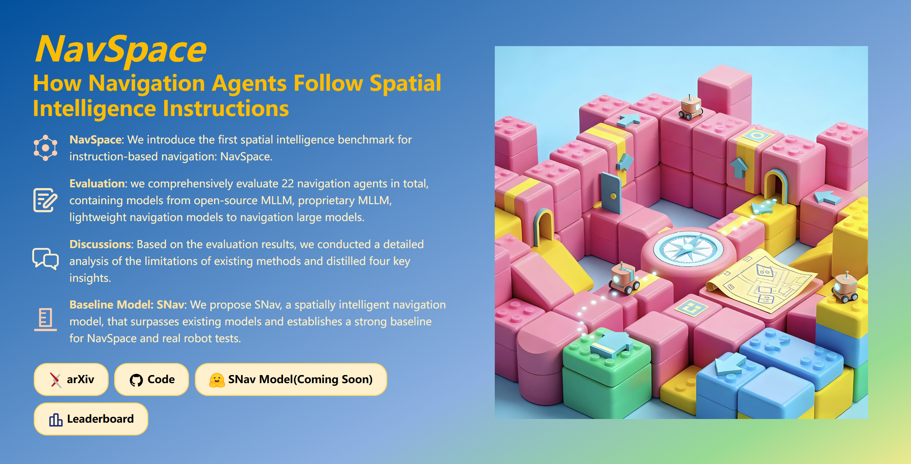

# NavSpace:  How Navigation Agents Follow Spatial Intelligence Instructions

Instruction-following navigation is a key step toward embodied intelligence. Prior benchmarks mainly focus on semantic understanding but overlook systematically evaluating navigation agents' spatial perception and reasoning capabilities. In this work, we introduce the NavSpace benchmark, which contains six task categories and 1,228 trajectory–instruction pairs designed to probe the spatial intelligence of navigation agents. On this benchmark, we comprehensively evaluate 22 navigation agents, including state-of-the-art navigation models and multimodal large language models. The evaluation results lift the veil on spatial intelligence in embodied navigation. Furthermore, we propose SNav, a new spatially intelligent navigation model. SNav outperforms existing navigation agents on NavSpace and real robot tests, establishing a strong baseline for future work.

## Dataset Overview
The NavSpace dataset contains vision-and-language navigation data for 6 sub-tasks, totaling 1,228 episodes.

### Episode Count by Sub-task:

| Environment State | Space Structure | Precise Movement | Viewpoint Shifting | Vertical Perception | Spatial Relationship | Total |
|------------------:|----------------:|-----------------:|-------------------:|--------------------:|---------------------:|------:|
| 200               | 200             | 201              | 207                | 208                 | 212                  | **1,228** |

## Dataset File Structure
Each subfolder contains three different JSON file formats:

### File Type Descriptions:
1. **`*_vln.json`**: 
   - Standard format used by Vision-and-Language Navigation (VLN) models
   - Contains complete episode information: coordinates, instructions, paths, etc.
   - Serves as the baseline file for data consistency validation

2. **`*_action.json`**: 
   - Contains ground-truth (GT) action sequences
   - Fully consistent with vln.json in core fields
   - Additional detailed action sequences and reference paths included

3. **`*_with_tokens.json`**: 
   - Pre-tokenized format designed for lightweight navigation models
   - Provides pre-tokenized instruction text for efficient processing
   - Scene paths may differ from other files (due to different training environments)

## Action Definitions
- **forward**: Move 0.25 meters straight
- **left/right**: Rotate 30° left or right
- **look-up/look-down**: Tilt camera up or down by 30°
- **backward**: Move 0.25 meters backward
- **stop**: End of trajectory

## Data Consistency
- All files maintain consistency in core fields: episode_id, instruction_text, coordinates, goal points, etc.
- scene_id paths may vary due to different environments, but scene filenames remain the same
- Data integrity ensured through validation program

## Usage Recommendations
1. Use `validate_dataset_integrity.py` to verify data integrity
2. Use `*_vln.json` as baseline for data comparison
3. Choose appropriate data format based on model requirements

## Evaluation Framework
- Evaluation program is available as `gpt_eval.py`, which requires a GPT API key.
- To run the evaluation process, execute the bash script `el.sh`
- Additional evaluation methods will be released soon...
