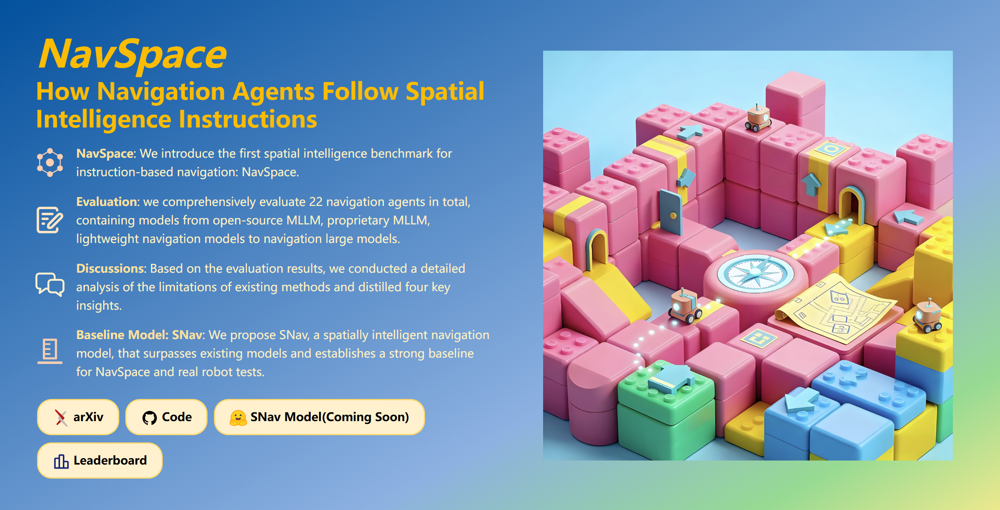
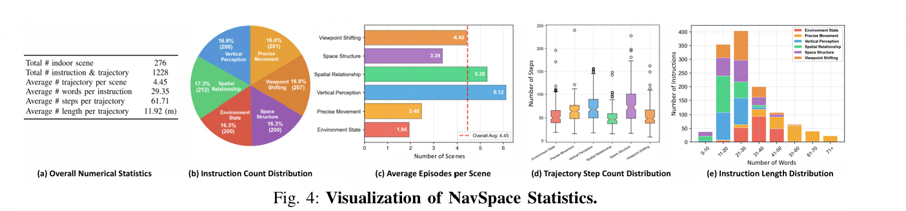
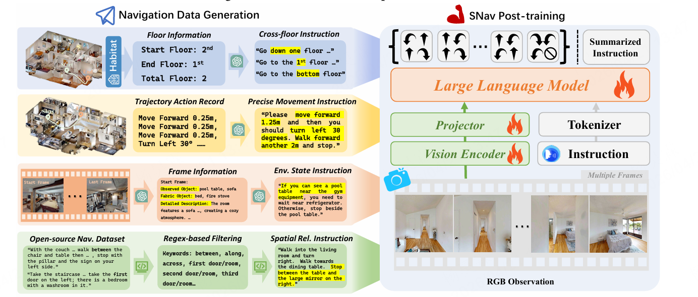

# [ICRA 2026] NavSpace: How Navigation Agents Follow Spatial Intelligence Instructions



---

## ✨ What is NavSpace?

Instruction-following navigation is a key step toward embodied intelligence. Existing
benchmarks mainly focus on semantic understanding but overlook a systematic evaluation of
**spatial perception and reasoning**. NavSpace fills this gap with **six task categories**
and **1,228 trajectory-instruction pairs**, and evaluates multimodal large language models,
local navigation models, and the proposed SNav baseline on the same benchmark.

This repository contains everything you need to reproduce, extend, and build on top of the
paper:

- 📊 **Benchmark data** — all six NavSpace subtasks.
- 🧪 **Evaluation suite** — LLM API / SNav / StreamVLN routes with a unified result format.
- ✏️ **Annotation pipeline** — Flask + Habitat-Sim web UI for collecting new trajectories, see `[docs/annotation.md](docs/annotation.md)`.
- 🎓 **SNav training code (Stage-1 vanilla baseline)** — runnable end-to-end from Habitat rendering to DeepSpeed SFT, see `[docs/training.md](docs/training.md)`. This is a *baseline* release: Video-QA mixing, height / lighting perturbation and full data-augmentation flows are out of scope and left for users to layer on top.

### Qualitative visualizations

The figure below shows typical agent rollouts on the six NavSpace subtasks — each column
is a different spatial-intelligence skill (environment state, space structure, precise
movement, viewpoint shifting, vertical perception, spatial relationship).



### SNav fine-tuning pipeline



Our SNav baseline is fine-tuned on top of Llava-Video-7b-Qwen2. The Stage-1 vanilla SFT recipe (Habitat rendering →  
LLaVA-Video-7B-Qwen2 SFT via DeepSpeed) is open-sourced under  
`[snav_training/](snav_training/)` — see the
[training guide](docs/training.md). For the full paper recipe you additionally
need Video-QA mixing (hook already exposed), height / lighting variation during
rendering, and the Stage-2/3 data-augmentation pipelines, which are deliberately
out of scope here; the baseline is meant to be extended.

---

## 🗺️ Navigate the repo


| Module                                       | Folder                                         | Docs                                                                                                     |
| -------------------------------------------- | ---------------------------------------------- | -------------------------------------------------------------------------------------------------------- |
| 🧪 Evaluation (LLM + SNav + StreamVLN)       | `[evaluation/](evaluation/)`                   | [中文 `docs/evaluation.md](docs/evaluation.md)` · [English `docs/evaluation_en.md](docs/evaluation_en.md)` |
| ✏️ Annotation pipeline (Flask + Habitat-Sim) | `[annotation_pipeline/](annotation_pipeline/)` | `[docs/annotation.md](docs/annotation.md)` *(中英双语: CN&EN Bilingual)*                                     |
| 🎓 SNav training (Stage-1 vanilla baseline)  | `[snav_training/](snav_training/)`             | `[docs/training.md](docs/training.md)` *(中英双语: CN&EN Bilingual)*                                         |
| 📦 Benchmark data                            | `[NavSpace-Datasets/](NavSpace-Datasets/)`     | built into `docs/evaluation.md`                                                                          |
| 🧰 Utilities                                 | `[tools/](tools/)`                             | built into `docs/evaluation.md` §0, §6                                                                   |


Jump straight to a module:

- **[Evaluation Guide (中文)](docs/evaluation.md)** — deploy Habitat-Sim / HM3D, run LLM / SNav / StreamVLN, merge shard results.
- **[Evaluation Guide (English)](docs/evaluation_en.md)** — complete English translation of the above.
- **[Annotation Pipeline Guide](docs/annotation.md)** — deploy the web UI, the 200-step familiarization gate, output JSON format.
- **[SNav Training Guide](docs/training.md)** — render expert trajectories, run Stage-1 vanilla SFT with DeepSpeed, and hand off the checkpoint to the evaluation suite.

---

## 📂 Repository layout

```text
NavSpace-main/
├── frontpage.png               # README hero figure
├── visualization.png           # qualitative rollouts figure
├── snav-finetune.png           # SNav pipeline figure
├── NavSpace-Datasets/          # benchmark data for the 6 subtasks
├── evaluation/                 # unified evaluation suite (LLM / SNav / StreamVLN)
├── annotation_pipeline/        # Flask + Habitat-Sim web UI for annotation
├── snav_training/              # SNav Stage-1 vanilla SFT (render + train + pipeline)
├── tools/                      # smoke_test / merge_results / llm_client / ...
├── docs/
│   ├── evaluation.md           # 中文评测指南
│   ├── evaluation_en.md        # English evaluation guide
│   ├── annotation.md           # Bilingual Annotation pipeline guide
│   └── training.md             # Bilingual Training Setup guide
├── gpt_eval.py                 # legacy wrapper -> evaluation/run_llm_eval
├── run_annotation_server.sh    # cd to repo root + start Flask annotation UI
├── el.sh                       # 8-way shard launcher
├── requirements-base.txt         # base deps
├── requirements-llm.txt          # LLM route deps
├── requirements-local-model.txt  # local-model route deps
└── requirements-annotation.txt   # annotation web UI deps (Flask + SocketIO)
```

---

## 📊 Benchmark at a glance

The NavSpace dataset contains VLN-style trajectories for six subtasks (1,228 episodes total):


| Environment State | Space Structure | Precise Movement | Viewpoint Shifting | Vertical Perception | Spatial Relationship | **Total** |
| ----------------- | --------------- | ---------------- | ------------------ | ------------------- | -------------------- | --------- |
| 200               | 200             | 201              | 207                | 208                 | 212                  | **1,228** |


Each subfolder under `NavSpace-Datasets/` ships three JSON flavours:

1. `*_vln.json` — **standard VLN format** (coordinates / instruction / goal / path). This is what the evaluation scripts in this repository consume.
2. `*_action.json` — ground-truth action sequences aligned with `*_vln.json`.
3. `*_with_tokens.json` — pre-tokenized format for lightweight navigation models.

### Action space


| Action                  | Effect                    |
| ----------------------- | ------------------------- |
| `forward`               | move 0.25 m straight      |
| `left` / `right`        | rotate 30° left / right   |
| `look-up` / `look-down` | tilt camera up / down 30° |
| `backward`              | move 0.25 m backward      |
| `stop`                  | end of trajectory         |


---

## 🚀 Quick start

```bash
# 1. Clone / download and enter the repo
cd NavSpace-main

# 2. (Optional) offline sanity check — no Habitat-Sim / HM3D / API key needed
python tools/smoke_test.py

# 3. Validate the shipped benchmark data
python NavSpace-Datasets/validate_dataset_integrity.py

# 4. After installing habitat-sim + downloading HM3D, run one LLM evaluation
export OPENAI_API_KEY=sk-xxxxx
python evaluation/run_llm_eval.py \
  --profile gemini-pro \
  --task environment_state \
  --hm3d-base-path /path/to/hm3d_v0.2
```

For everything else — provider selection, API keys, SNav / StreamVLN setup, parallel sharding,
result merging and offline verification — open the **[Evaluation Guide](docs/evaluation.md)**.

---

## 📦 Dependencies

Dependency files are split by usage so you only install what you need:

- `requirements-base.txt` — common runtime dependencies.
- `requirements-llm.txt` — LLM API clients (OpenAI-compatible + Zhipu).
- `requirements-local-model.txt` — local-model route (torch / transformers / decord / ...).
- `requirements-annotation.txt` — Flask + Flask-SocketIO web UI for the annotation pipeline.

`habitat-sim` / `habitat-lab` and the HM3D / MP3D assets still have to be installed separately
per your platform and CUDA version — see [§1 of the Evaluation Guide](docs/evaluation.md#1-部署指南三类评测通用).

---

## 🗺️ Roadmap

- Public benchmark data for all six subtasks.
- Unified evaluation suite (LLM / SNav / StreamVLN).
- Annotation pipeline with a 200-step familiarization gate.
- Offline verification (`tools/smoke_test.py`, `--dry-run`).
- SNav Stage-1 vanilla SFT baseline (`snav_training/`).
- Height / lighting variation during rendering.
- Data-augmentation scripts (LLM-based instruction rewriting, panorama aug, DAgger).
- Pretrained SNav checkpoints.

---

## 📎 Citation

```bibtex
@misc{yang2026navspacenavigationagentsfollow,
      title={NavSpace: How Navigation Agents Follow Spatial Intelligence Instructions}, 
      author={Haolin Yang and Yuxing Long and Zhuoyuan Yu and Zihan Yang and Minghan Wang and Jiapeng Xu and Yihan Wang and Ziyan Yu and Wenzhe Cai and Lei Kang and Hao Dong},
      year={2026},
      eprint={2510.08173},
      archivePrefix={arXiv},
      primaryClass={cs.RO},
      url={https://arxiv.org/abs/2510.08173}, 
}
```

Paper: [https://arxiv.org/abs/2510.08173](https://arxiv.org/abs/2510.08173)  ·  Project website: [https://navspace.github.io/](https://navspace.github.io/)

---

## Star, cite & issues

If NavSpace is useful for your work, a **GitHub star** helps others discover the repo and keeps us motivated. If you use this benchmark or code in a paper or report, please **cite** the BibTeX entry above. Bug reports, feature ideas, and discussion are welcome—please open an **Issue** on GitHub so we can track and improve the project together.

---
