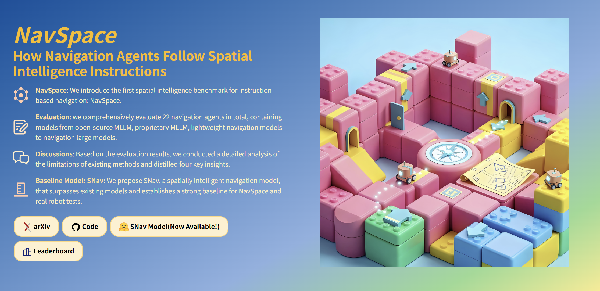
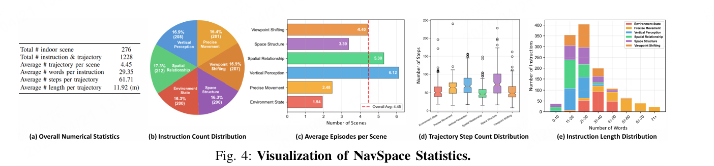
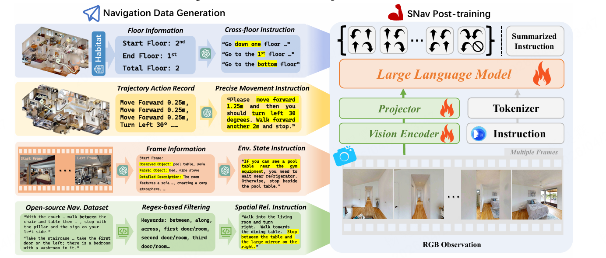

# [ICRA 2026] NavSpace: How Navigation Agents Follow Spatial Intelligence Instructions



## Paper & Project Website

- **ArXiv (paper):** [NavSpace — How Navigation Agents Follow Spatial Intelligence Instructions](https://arxiv.org/abs/2510.08173)
- **Project website:** [https://navspace.github.io/](https://navspace.github.io/)

## Highlights

- NavSpace is the **first benchmark** for evaluating spatial intelligence in embodied navigation
- We manually collect 6 task categories and 1,228 trajectory-instruction pairs
- We comprehensively evaluate 22 navigation agents
- We propose a strong baseline model, **SNav**, validated on both NavSpace and real robot tests. **SNav** achieves **SoTA** in all validations.
- All codes, including the two-stage training recipes and SoTA model SNav are opensourced.

---

## ✨ What is NavSpace?

Instruction-following navigation is a key step toward embodied intelligence. Existing
benchmarks mainly focus on semantic understanding but overlook a systematic evaluation of
**spatial perception and reasoning**. NavSpace fills this gap with **six task categories**
and **1,228 trajectory-instruction pairs**, and evaluates multimodal large language models,
local navigation models, and the proposed SNav baseline on the same benchmark.

This repository contains:

- 📊 **Benchmark data** — all six NavSpace subtasks (`NavSpace-Datasets/`).
- 🧪 **Evaluation suite** — LLM API / SNav / StreamVLN routes with a unified result format.
- ✏️ **Annotation pipeline** — Flask + Habitat-Sim web UI for collecting new trajectories.
- 🎓 **SNav training** — paper training chain under [`snav_training/`](snav_training/)
  (Stage A VLN-mix → Stage B aug_mix+manual98), plus Habitat renderers and a baseline
  Stage-1 trainer. Data-augmentation scripts live in [`data_augmentation/`](data_augmentation/).
  **Training / render data and pretrained SNav weights are not shipped** — download scenes,
  VLN-CE / LLaVA assets yourself; weights will be released separately (e.g. Hugging Face).

### Qualitative visualizations

The figure below shows typical agent rollouts on the six NavSpace subtasks — each column
is a different spatial-intelligence skill (environment state, space structure, precise
movement, viewpoint shifting, vertical perception, spatial relationship).



### SNav fine-tuning pipeline



SNav is fine-tuned from **LLaVA-Video-7B-Qwen2** (+ SigLIP) in two CorrectNav-style SFT stages:

1. **Stage A — VLN-mix** — collect/build under `snav_training/stage_a/`
   (`prepare_stage_a_data.sh`), then `launch_vln_mix_stage_a.sh`
   (nav-only YAML by default; full paper mix + LLaVA-OE optional).
2. **Stage B — paper final** (`launch_paper_sft_stage_b.sh`): `aug_mix` + `manual_98`
   (hist=8, future=6).

Launch commands and layout: [`snav_training/README.md`](snav_training/README.md).  
Augmentation pipelines that produce Stage-B images: [`data_augmentation/`](data_augmentation/).

> **Note on data.** Training / render frames and JSONs are **not** shipped. Stage A:
> download MP3D + R2R-CE + RxR-CE, then
> `bash snav_training/scripts/prepare_stage_a_data.sh`. Stage B:
> `data_augmentation/` → `snav_data/aug_mix` (+ optional `manual_98`), then
> `snav_training/scripts/build_hist8_future6.py`. LLaVA-Video OE JSONs (paper full
> Stage A) remain optional external assets.

---

## 🗺️ Navigate the repo


| Module                                       | Folder                                         | Docs                                                                                                     |
| -------------------------------------------- | ---------------------------------------------- | -------------------------------------------------------------------------------------------------------- |
| 🧪 Evaluation (LLM + SNav + StreamVLN)       | [evaluation/](evaluation/)                      | [中文文档](docs/evaluation.md) · [English](docs/evaluation_en.md)                                           |
| ✏️ Annotation pipeline (Flask + Habitat-Sim) | [annotation_pipeline/](annotation_pipeline/) | [docs/annotation.md](docs/annotation.md) *(中英双语: CN&EN Bilingual)*                                      |
| 🎓 SNav training (paper + baseline)          | [snav_training/](snav_training/)              | [snav_training/README.md](snav_training/README.md) · [docs/training.md](docs/training.md) *(legacy baseline notes)* |
| 🧩 Data augmentation (Stage B images)        | [data_augmentation/](data_augmentation/)      | [data_augmentation/README.md](data_augmentation/README.md)                                               |
| 📦 Benchmark data                            | [NavSpace-Datasets/](NavSpace-Datasets/)       | built into [docs/evaluation.md](docs/evaluation.md)                                                      |
| 🧰 Utilities                                 | [tools/](tools/)                              | built into [docs/evaluation.md](docs/evaluation.md) §0, §6                                                |


Jump straight to a module:

- **[Evaluation Guide (中文)](docs/evaluation.md)** — deploy Habitat-Sim / HM3D, run LLM / SNav / StreamVLN, merge shard results.
- **[Evaluation Guide (English)](docs/evaluation_en.md)** — complete English translation of the above.
- **[Annotation Pipeline Guide](docs/annotation.md)** — deploy the web UI, the 200-step familiarization gate, output JSON format.
- **[SNav Training (paper chain)](snav_training/README.md)** — Stage A / Stage B launchers, hist8 JSON builder, render entrypoints.

---

## 📂 Repository layout

```text
NavSpace/
├── frontpage.png               # README hero figure
├── visualization.png           # qualitative rollouts figure
├── snav-finetune.png           # SNav pipeline figure
├── NavSpace-Datasets/          # benchmark data for the 6 subtasks
├── evaluation/                 # unified evaluation suite (LLM / SNav / StreamVLN)
├── annotation_pipeline/        # Flask + Habitat-Sim web UI for annotation
├── snav_training/              # paper SFT (snav_llava) + render + baseline Stage-1
├── data_augmentation/          # Stage-B aug pipelines (no data shipped)
├── tools/                      # smoke_test / merge_results / llm_client / ...
├── docs/
│   ├── evaluation.md           # 中文评测指南
│   ├── evaluation_en.md        # English evaluation guide
│   ├── annotation.md           # Bilingual Annotation pipeline guide
│   └── training.md             # older Stage-1 baseline notes (see snav_training/README.md)
├── gpt_eval.py                 # legacy wrapper -> evaluation/run_llm_eval
├── run_annotation_server.sh    # cd to repo root + start Flask annotation UI
├── el.sh                       # 8-way shard launcher
├── requirements-base.txt         # base deps
├── requirements-llm.txt          # LLM route deps
├── requirements-local-model.txt  # local-model route deps
└── requirements-annotation.txt   # annotation web UI deps (Flask + SocketIO)
```

---

## 📊 Benchmark at a glance

The NavSpace dataset contains VLN-style trajectories for six subtasks (1,228 episodes total):


| Environment State | Space Structure | Precise Movement | Viewpoint Shifting | Vertical Perception | Spatial Relationship | **Total** |
| ----------------- | --------------- | ---------------- | ------------------ | ------------------- | -------------------- | --------- |
| 200               | 200             | 201              | 207                | 208                 | 212                  | **1,228** |


Each subfolder under `NavSpace-Datasets/` ships three JSON flavours:

1. `*_vln.json` — **standard VLN format** (coordinates / instruction / goal / path). This is what the evaluation scripts in this repository consume.
2. `*_action.json` — ground-truth action sequences aligned with `*_vln.json`.
3. `*_with_tokens.json` — pre-tokenized format for lightweight navigation models.

### Action space


| Action                  | Effect                    |
| ----------------------- | ------------------------- |
| `forward`               | move 0.25 m straight      |
| `left` / `right`        | rotate 30° left / right   |
| `look-up` / `look-down` | tilt camera up / down 30° |
| `backward`              | move 0.25 m backward      |
| `stop`                  | end of trajectory         |


---

## 🚀 Quick start

```bash
# 1. Clone / download and enter the repo
cd NavSpace

# 2. (Optional) offline sanity check — no Habitat-Sim / HM3D / API key needed
python tools/smoke_test.py

# 3. Validate the shipped benchmark data
python NavSpace-Datasets/validate_dataset_integrity.py

# 4. After installing habitat-sim + downloading HM3D, run one LLM evaluation
export OPENAI_API_KEY=sk-xxxxx
python evaluation/run_llm_eval.py \
  --profile gemini-pro \
  --task environment_state \
  --hm3d-base-path /path/to/hm3d_v0.2
```

For SNav local-model eval (after you have a checkpoint + SigLIP + HM3D):

```bash
python evaluation/eval_snav.py \
  --model-path /path/to/SNav-7B \
  --vision-tower-path /path/to/siglip-so400m-patch14-384 \
  --hm3d-base-path /path/to/hm3d_v0.2 \
  --task environment_state
```

For everything else — provider selection, API keys, StreamVLN setup, parallel sharding,
result merging and offline verification — open the **[Evaluation Guide](docs/evaluation.md)**.  
For training: **[snav_training/README.md](snav_training/README.md)**.

---

## 📦 Dependencies

Dependency files are split by usage so you only install what you need:

- `requirements-base.txt` — common runtime dependencies.
- `requirements-llm.txt` — LLM API clients (OpenAI-compatible + Zhipu).
- `requirements-local-model.txt` — local-model route (torch / transformers / decord / ...).
- `requirements-annotation.txt` — Flask + Flask-SocketIO web UI for the annotation pipeline.
- `snav_training/requirements_paper.txt` — **reference freeze** from an internal training host
  (includes private pins). Prefer installing `deepspeed`, `accelerate`, `transformers`, and
  optionally `flash-attn` into a CUDA-matched env; see [`snav_training/README.md`](snav_training/README.md).

`habitat-sim` / `habitat-lab` and the HM3D / MP3D / R2R-CE / RxR-CE assets still have to be
installed separately per your platform and CUDA version — see
[§1 of the Evaluation Guide](docs/evaluation.md#1-部署指南三类评测通用) and the training README.

---

## 🗺️ Roadmap

- [x] Public benchmark data for all six subtasks.
- [x] Unified evaluation suite (LLM / SNav / StreamVLN).
- [x] Annotation pipeline with a 200-step familiarization gate.
- [x] Offline verification (`tools/smoke_test.py`, `--dry-run`).
- [x] SNav paper training entrypoints (`snav_training/`: Stage A/B launchers + `snav_llava`).
- [x] Stage A VLN-mix **nav data builders** (`snav_training/stage_a/` + `prepare_stage_a_data.sh`).
- [x] Data-augmentation scripts (`data_augmentation/`).
- [ ] LLaVA-Video OE JSON packaging for the optional full Stage-A mix (external asset).
- [ ] Pretrained SNav checkpoints (Hugging Face release).

---

## 📎 Citation

```bibtex
@misc{yang2026navspacenavigationagentsfollow,
      title={NavSpace: How Navigation Agents Follow Spatial Intelligence Instructions}, 
      author={Haolin Yang and Yuxing Long and Zhuoyuan Yu and Zihan Yang and Minghan Wang and Jiapeng Xu and Yihan Wang and Ziyan Yu and Wenzhe Cai and Lei Kang and Hao Dong},
      year={2026},
      eprint={2510.08173},
      archivePrefix={arXiv},
      primaryClass={cs.RO},
      url={https://arxiv.org/abs/2510.08173}, 
}
```

Paper: [https://arxiv.org/abs/2510.08173](https://arxiv.org/abs/2510.08173)  ·  Project website: [https://navspace.github.io/](https://navspace.github.io/)

---

## Star, cite & issues

If NavSpace is useful for your work, a **GitHub star** helps others discover the repo and keeps us motivated. If you use this benchmark or code in a paper or report, please **cite** the BibTeX entry above. Bug reports, feature ideas, and discussion are welcome—please open an **Issue** on GitHub so we can track and improve the project together.

---
